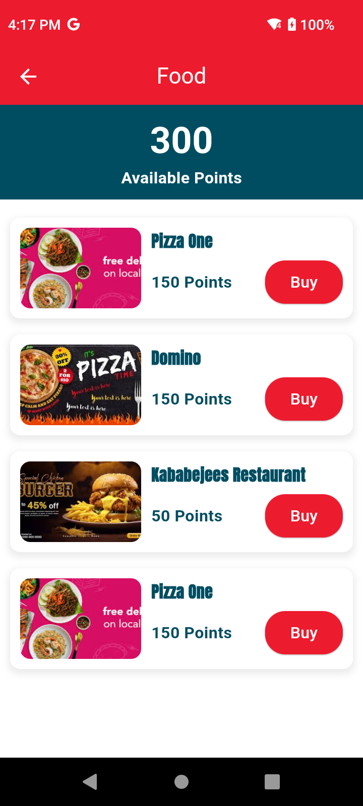

## Loyalty App

The Loyalty App features a beautifully crafted UI design that provides an intuitive and seamless user experience. The interface is carefully structured to ensure easy navigation across various functionalities, such as login and signup, point collection through an integrated scanner, and viewing point history. The catalog section is designed with visually appealing product displays, complete with detailed descriptions and images to guide user decisions. Profile management is streamlined for updating personal details and managing preferences, while notifications are presented in a clean, user-friendly manner to highlight promotions, offers, and point expiry. The app’s aesthetic combines modern design principles with responsive layouts to ensure an engaging experience across devices, fostering a strong visual connection between users and the loyalty platform.

## App Screenshots

Below are the app screenshots showcasing various features and designs:

|      |              |         |          |
|-----------------------------------------------|------------------------------------------------------|------------------------------------------------|-----------------------------------------------|
|         |              |    |      |
| --------------------------------------------- | ---------------------------------------------        | ---------------------------------------------- | --------------------------------------------- |
|       |  |      |    |
| --------------------------------------------- | ---------------------------------------------        | ---------------------------------------------- | --------------------------------------------- |
